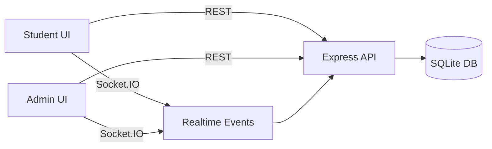

# Exam Data Acquisition & Monitoring Portal

A modern, real-time exam monitoring portal with dedicated Student and Admin experiences, live telemetry, and a lightweight SQLite backend.

---

## Highlights
- Dual portals: student exam flow and admin management dashboard
- Real-time telemetry: click activity, stress level, and session events via Socket.IO
- Live analytics: active students, submissions, stress, and click metrics
- Secure admin access with JWT
- Simple local persistence with SQLite

---

## Tech Stack

Frontend
- Next.js (App Router)
- React
- Axios
- Socket.IO Client

Backend
- Node.js + Express
- SQLite (better-sqlite3)
- Socket.IO
- JWT + bcrypt
- Zod validation

---

## Architecture



---

## Project Structure

```
Exam_portal_for_Data/
  backend/
    src/
      controllers/
      db/
      middlewares/
      routes/
      sockets/
      utils/
  frontend/
    src/
      app/
      api/
      components/
      hooks/
      screens/
        admin/
        student/
      utils/
```

---

## Getting Started

Prerequisites
- Node.js (LTS recommended)
- npm

Backend
```
cd backend
npm install
npm run dev
```

Frontend
```
cd frontend
npm install
npm run dev
```

The frontend runs at http://localhost:3000 by default.

Run Both (Two Terminals)

Terminal 1:
```
cd backend
npm install
npm run dev
```

Terminal 2:
```
cd frontend
npm install
npm run dev
```

---

## Environment Variables

Backend (.env)
File: [backend/.env](backend/.env)

```
PORT=5000
JWT_SECRET=super_secret_change_me
ADMIN_USERNAME=admin
ADMIN_PASSWORD=admin123
CLIENT_ORIGIN=http://localhost:3000
DB_PATH=./exam-portal.db
```

Frontend (.env)
File: [frontend/.env](frontend/.env)

```
NEXT_PUBLIC_API_URL=http://localhost:5000
NEXT_PUBLIC_SOCKET_URL=http://localhost:5000
NEXT_PUBLIC_CLICK_WINDOW_MS=40000
NEXT_PUBLIC_VIOLATION_THRESHOLD=3
```

The last two variables are optional and default to the shown values if omitted.

---

## Default Admin Credentials
- Username: `admin`
- Password: `admin123`

Change these in [backend/.env](backend/.env) for production use.

---

## Usage Flow
1. Start backend and frontend.
2. Admin logs in and creates an exam with questions.
3. Student logs in, selects an exam, and starts the session.
4. Live telemetry and activity feed updates appear on the admin dashboard.

---

## Realtime Events
The backend emits Socket.IO events consumed by the admin dashboard:

- `student_started`
- `answer_saved`
- `click_update`
- `stress_update`
- `exam_submitted`

---

## API Overview

Auth & Sessions
- `POST /api/admin/login`
- `POST /api/students/login`
- `POST /api/students/exams/:examId/start`

Student Telemetry
- `POST /api/sessions/:sessionId/response`
- `POST /api/sessions/:sessionId/clicks`
- `POST /api/sessions/:sessionId/stress`
- `POST /api/sessions/:sessionId/submit`

Admin
- `GET /api/admin/dashboard/live`
- `GET /api/admin/exams`
- `POST /api/admin/exams`
- `DELETE /api/admin/exams/:id`
- `GET /api/admin/exams/:id/questions`
- `POST /api/admin/questions`
- `DELETE /api/admin/questions/:id`
- `GET /api/admin/students`
- `DELETE /api/admin/students/:id`
- `GET /api/admin/sessions`
- `GET /api/admin/sessions/:sessionId`

---

## Data Model (SQLite)
Core tables created on startup:
- `admins`
- `students`
- `exams`
- `questions`
- `exam_sessions`
- `responses`
- `telemetry_events`

---

## Useful Scripts

Backend
- `npm run dev` – start API with nodemon
- `npm start` – start API (no watch)

Frontend
- `npm run dev` – start Next.js dev server
- `npm run build` – build for production
- `npm run start` – run production build

---

## Health Check
The backend exposes:
- `GET /api/health` → `{ "status": "ok" }`

---

## Security Notes
- Update `JWT_SECRET` before deploying.
- Replace default admin credentials in [backend/.env](backend/.env).

---

## Notes
This project is designed for local development and demo environments. Extend authentication, rate limiting, and persistence as needed for production.
